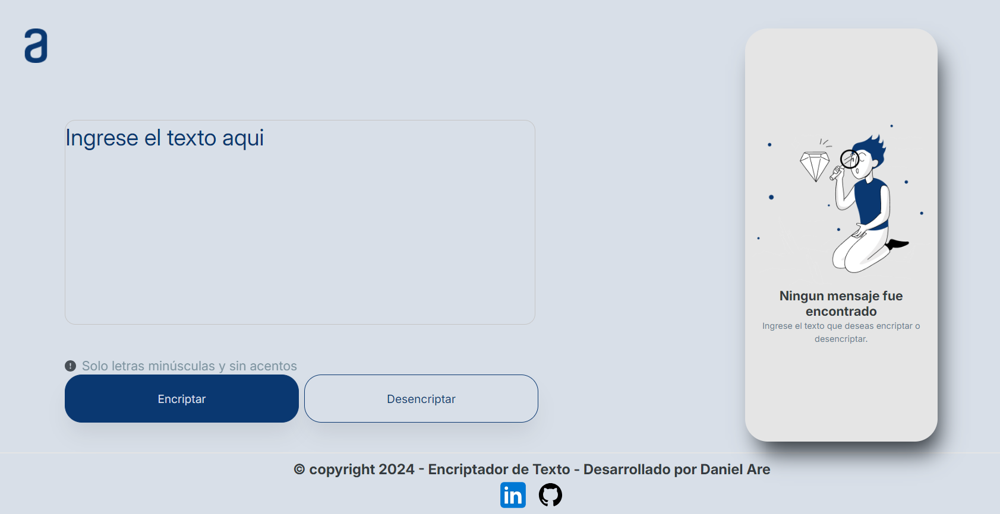
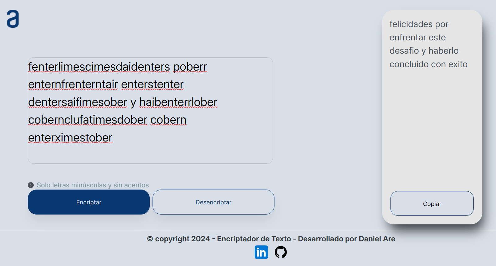
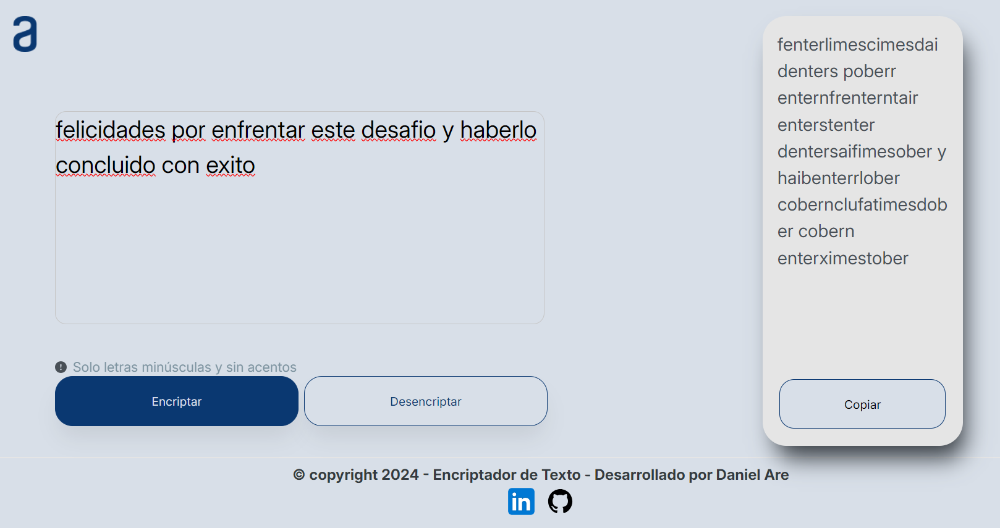

# # Encriptador de Texto 📋
Este es mi Encriptador de Texto, realizado en el programa Oracle_ONE de Alura Latam.

## website-responsvive 🚀

## Comenzando ⚙️

_Puedes descargar el repositorio y consultar el Código de las siguientes maneras:_

- Dando clic en **Code** en el repositorio y después **Download ZIP**..
- Haciendo un **Git clone** del repositorio directamente en tu computadora
- Ingresando al siguiente link para ver el preview [Encriptador de Texto]()

### Preview del proyecto 📋

## Autor ✒️

- **Daniel Arellano** - \*\* - [Tachuelin](https://github.com/Tachuelin)